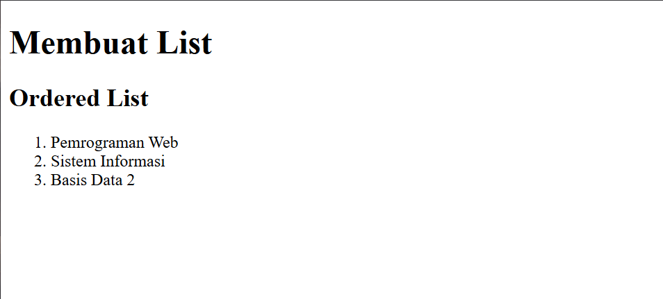

# Praktikum 3: Membuat List, Table dan Form

## Nama: Syafarudiansya
## NIM: 312410381
## Kelas: TI 24 A6

### Penjelasan Praktikum

#### A. Pembuatan List

1. Ordered List
Ordered list di HTML digunakan untuk membuat daftar yang terurut (bernomor). Tag utamanya adalah `<ol>` (ordered list), dan setiap item di dalamnya ditulis dengan `<li>` (list item).

```hmtl
<section id="order-list">
    <h2>Ordered List</h2>
    <ol>
      <li>Pemrograman Web</li>
      <li>Sistem Informasi</li>
      <li>Basis Data 2</li>
    </ol>
  </section>
```

