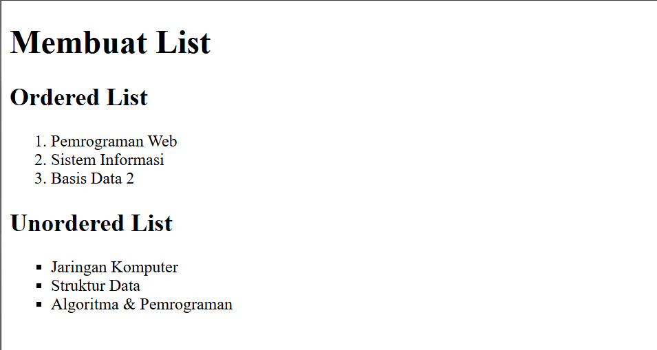
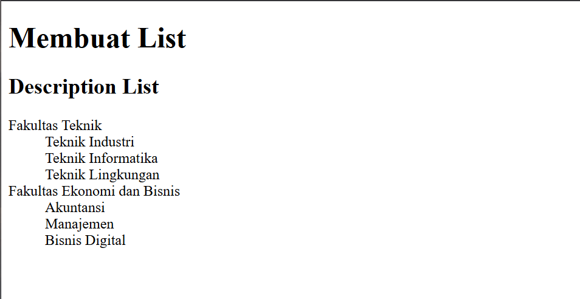
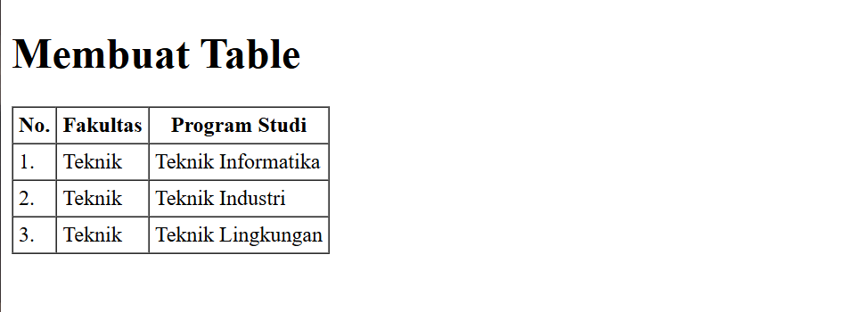
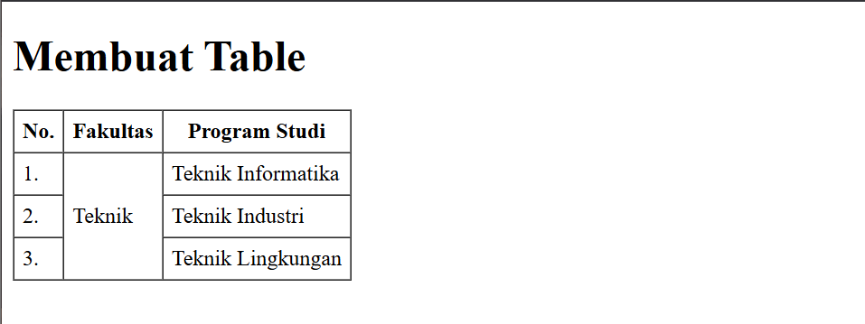
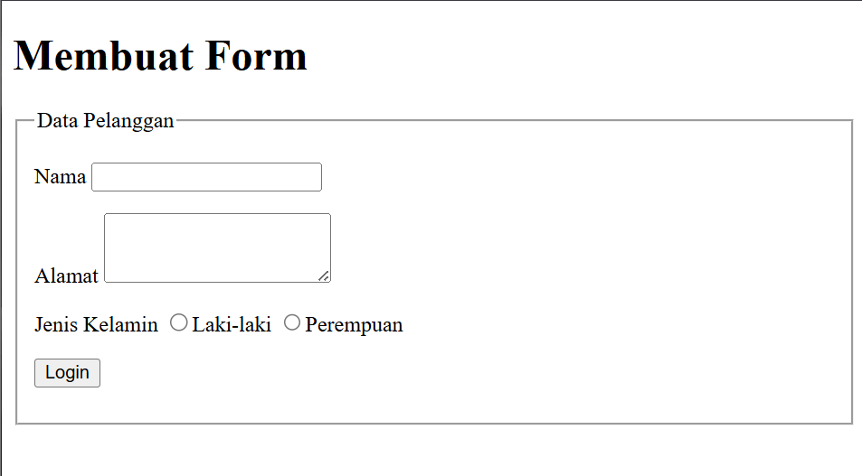

# Praktikum 3: Membuat List, Table dan Form

## Nama: Syafarudiansya
## NIM: 312410381
## Kelas: TI 24 A6

### Penjelasan Praktikum

#### A. Pembuatan List

1. Ordered List
   
Ordered list di HTML digunakan untuk membuat daftar yang terurut (bernomor). Tag utamanya adalah `<ol>` (ordered list), dan setiap item di dalamnya ditulis dengan `<li>` (list item).

```html
<section id="order-list">
    <h2>Ordered List</h2>
    <ol>
      <li>Pemrograman Web</li>
      <li>Sistem Informasi</li>
      <li>Basis Data 2</li>
    </ol>
  </section>
```


2. Unordered List
   
Unordered list di HTML digunakan untuk membuat daftar tidak berurutan, biasanya ditandai dengan titik `(•)` atau simbol lain. Tag utamanya adalah `<ul>` (unordered list), dan setiap itemnya pakai `<li> `sama seperti ordered list.

```html
<section id="unorder-list">
    <h2>Unordered List</h2>
    <ul type="square">
      <li>Jaringan Komputer</li>
      <li>Struktur Data</li>
      <li>Algoritma &amp; Pemrograman</li>
    </ul>
  </section>
```


3. Description List
   
Description list di HTML dipakai untuk membuat daftar berpasangan, biasanya berisi judul (istilah) dan penjelasannya.
Tag yang digunakan yaitu:

`<dl>` (description list) : pembungkus daftar

`<dt>` (description term) : istilah atau judul

`<dd>` (description detail) : penjelasan dari istilah

```html
<section id="unorder-list">
    <h2>Description List</h2>
    <dl>
      <dt>Fakultas Teknik</dt>
      <dd>Teknik Industri</dd>
      <dd>Teknik Informatika</dd>
      <dd>Teknik Lingkungan</dd>
      <dt>Fakultas Ekonomi dan Bisnis</dt>
      <dd>Akuntansi</dd>
      <dd>Manajemen</dd>
      <dd>Bisnis Digital</dd>
    </dl>
  </section>
```


#### B. Table

1. Membuat Table
   
Tabel di HTML digunakan untuk menampilkan data dalam bentuk baris dan kolom.
Tag utama yang dipakai yaitu:

`<table>` : wadah tabel

`<tr>` : baris tabel (table row)

`<th>` : sel judul (table header)

`<td>` : sel data (table data)

```html
<table border="1" cellpadding="4" cellspacing="0">
    <thead>
      <tr>
        <th>No.</th>
        <th>Fakultas</th>
        <th>Program Studi</th>
      </tr>
    </thead>
    <tbody>
      <tr>
        <td>1.</td>
        <td>Teknik</td>
        <td>Teknik Informatika</td>
      </tr>
      <tr>
        <td>2.</td>
        <td>Teknik</td>
        <td>Teknik Industri</td>
      </tr>
      <tr>
        <td>3.</td>
        <td>Teknik</td>
        <td>Teknik Lingkungan</td>
      </tr>
    </tbody>
  </table>
```


2. Mengatur Margin dan Padding
   
Untuk mengatur margin dan padding pada cel data, tambahkan atribut `cellpadding` dan `cellspacing` pada tag table.

```html
 <table border="1" cellpadding="4" cellspacing="0">
```

3. Menggabungkan Sel Data
   
Gunakan atribut `rowspan` (menggabungkan baris ke bawah) dan `colspan` (menggabungkan kolom ke samping) untuk menggabungkan sel data

```html
  <table border="1" cellpadding="4" cellspacing="0">
    <thead>
      <tr>
        <th>No.</th>
        <th>Fakultas</th>
        <th>Program Studi</th>
      </tr>
    </thead>
    <tbody>
      <tr>
        <td>1.</td>
        <td rowspan="3">Teknik</td>
        <td>Teknik Informatika</td>
      </tr>
      <tr>
        <td>2.</td>
        <td>Teknik Industri</td>
      </tr>
      <tr>
        <td>3.</td>
        <td>Teknik Lingkungan</td>
      </tr>
    </tbody>
  </table>
```


#### C. Form

1. Membuat Form

Form di HTML digunakan untuk mengumpulkan data dari pengguna, seperti nama, alamat, jenis kelamin, dan lainnya. Form biasanya terdiri dari berbagai elemen input, seperti kotak teks, area teks, tombol, dan radio button.

```html
  <form action="proses.php" method="post">
    <fieldset>
      <legend>Data Pelanggan</legend>
      <p>
        <label for="nama">Nama</label>
        <input type="text" id="nama" name="nama" />
      </p>
      <p>
        <label for="alamat">Alamat</label>
        <textarea id="alamat" name="alamat" cols="20" rows="3"></textarea>
      </p>
      <p>
        <label>Jenis Kelamin</label>
        <input id="jk_l" type="radio" name="kelamin" value="L" /><label
          for="jk_l"
          >Laki-laki</label
        >
        <input id="jk_p" type="radio" name="kelamin" value="P" /><label
          for="jk_p"
          >Perempuan</label
        >
      </p>
      <p>
        <label for="kota">Kota</label>
        <select id="kota" name="kota">
          <option value="">-- Pilih Kota --</option>
          <option value="jakarta">Jakarta</option>
          <option value="bandung">Bandung</option>
          <option value="surabaya">Surabaya</option>
          <option value="medan">Medan</option>
        </select>
      </p>
      <p class="hobi-row">
        <label for="hobi">Hobi</label>
        <select id="hobi" name="hobi[]" multiple size="4">
          <option value="membaca">Membaca</option>
          <option value="olahraga">Olahraga</option>
          <option value="musik">Musik</option>
          <option value="traveling">Traveling</option>
          <option value="gaming">Gaming</option>
        </select>
      </p>

      <p><input type="submit" value="Login" /></p>
    </fieldset>
  </form>
```


2. Menabahkan Style pada Form
Menambahkan CSS ke Form agar terlihat menarik

```css
<style>
    form p > label {
      display: inline-block;
      width: 100px;
    }
    form input[type="text"],
    form textarea {
      border: 1.5px solid #197a43;
    }
    form input[type="submit"] {
      border: px solid #197a43;
      background-color: #197a43;
      color: #ffffff;
      font-weight: bold;
      padding: 5px 15px;
  </style>
```

